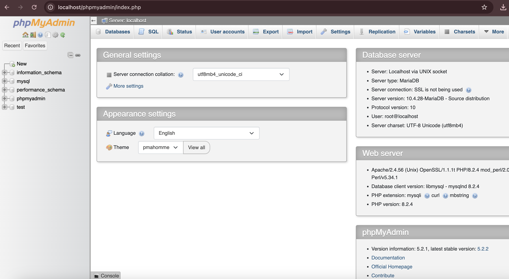
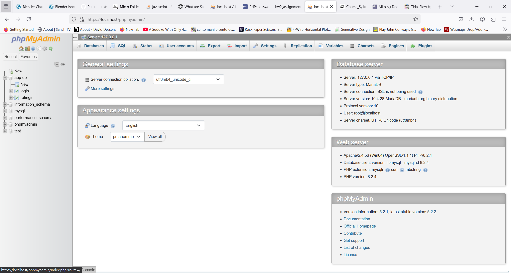

# NeuroTune – AI Music Discovery & Rating App

## Team Members
- Felix Berliner
- Will Drake
- Marouan El-Asery

## Project Overview
This project started as a landing page for **Homework 1 in COMP 333**. For **Homework 2**, it has been expanded into a full-stack **CRUD web application** with user authentication and a **MySQL database**. For **Homework 3**, the backend has been modified to work with a mobile frontend.

### Features
- **User Authentication**: Register, log in, and log out securely
- **CRUD Operations**: Add, view, update, and delete song ratings
- **MySQL Database**: Stores user credentials and song ratings
- **Session Management**: Users stay logged in with PHPSESSID
- **Deployment**: Hosted on InfinityFree

Each team member contributed **equally (33.33%)** to the project.

## Functionality

### **User Authentication**
- Registration and login system
- Passwords are **hashed** and stored securely
- Users remain logged in via PHP sessions
- Duplicate usernames are not allowed

### **CRUD Music Rating System**
- Users can **add a song rating** (title, artist, rating)
- Users can **view all song ratings** in the database
- Users can **edit and delete their own ratings**
- Users **cannot edit or delete ratings added by others**

### **Database Integration**
- MySQL database hosted on **InfinityFree**
- Two tables:
  - `login` (stores usernames and hashed passwords)
  - `ratings` (stores song ratings with a foreign key to `login`)

### **Security Measures**
- **Passwords are hashed** 
- **SQL queries are parameterized** to prevent SQL injection
- **Session management** ensures authentication security
- **Form validation** prevents incorrect input

---

## Installation Guide

### **1. Setup XAMPP (Local Development)**
1. Download and install **XAMPP** from [Apache Friends](https://www.apachefriends.org/)
2. Start **Apache** and **MySQL** from the XAMPP Control Panel
3. Place all project files inside the `htdocs/` folder

### **2. Create the MySQL Database (Local)**
1. Open phpMyAdmin (`http://localhost/phpmyadmin`)
2. Run the following SQL commands:

```sql
CREATE DATABASE app_db;

USE app_db;

CREATE TABLE login (
    username VARCHAR(255) PRIMARY KEY,
    password VARCHAR(255) NOT NULL
);

CREATE TABLE ratings (
    id INT AUTO_INCREMENT PRIMARY KEY,
    username VARCHAR(255),
    song VARCHAR(255) NOT NULL,
    artist VARCHAR(255) NOT NULL,
    rating INT NOT NULL CHECK (rating BETWEEN 0 AND 9),
    FOREIGN KEY (username) REFERENCES login(username) ON DELETE CASCADE
);
```

### **3. Configure Database Connection**
Modify `connection.php` to match local database credentials:

```php
$servername = "localhost";
$username = "root";
$password = "";
$db_name = "app_db";

$conn = new mysqli($servername, $username, $password, $db_name);

if ($conn->connect_error) {
    die("Connection failed: " . $conn->connect_error);
}
?>
```

### **4. Run the Web App**
1. Start **Apache** and **MySQL** in XAMPP
2. Open `http://localhost/index.php` in a web browser
3. Register an account and test the CRUD functionality

---

## Deployment to InfinityFree

### **1. Set Up Hosting**
1. Sign up on [InfinityFree](https://www.infinityfree.net/)
2. Create a new hosting account
3. Click **"Control Panel"** and open **"MySQL Databases"**
4. Take note of:
   - **Database name**: `if0_38465106_app_db`
   - **MySQL username**: `if0_38465106`
   - **Host**: `sql209.infinityfree.com`
   - **Password**: (Your InfinityFree vPanel password)

### **2. Create the Remote Database**
Run this SQL in **InfinityFree's phpMyAdmin**:

```sql
CREATE TABLE login (
    username VARCHAR(255) PRIMARY KEY,
    password VARCHAR(255) NOT NULL
);

CREATE TABLE ratings (
    id INT AUTO_INCREMENT PRIMARY KEY,
    username VARCHAR(255),
    song VARCHAR(255) NOT NULL,
    artist VARCHAR(255) NOT NULL,
    rating INT NOT NULL CHECK (rating BETWEEN 0 AND 9),
    FOREIGN KEY (username) REFERENCES login(username) ON DELETE CASCADE
);
```

### **3. Update `connection.php` for Deployment**
Modify `connection.php` with InfinityFree credentials:

```php
$servername = "sql209.infinityfree.com"; 
$username = "if0_38465106"; 
$password = "your-password-here";  
$db_name = "if0_38465106_app_db";  

$conn = new mysqli($servername, $username, $password, $db_name);

if ($conn->connect_error) {
    die("Connection failed: " . $conn->connect_error);
}
?>
```

### **4. Upload Files**
1. Use **InfinityFree's File Manager**
2. Navigate to `htdocs/`
3. Upload all project files

### **5. Test Deployed Version**
- Visit: [https://swe333.great-site.net/](https://swe333.great-site.net/)
- Ensure database connection and CRUD features are working

### **6. Enable SSL**
1. Go to **Control Panel → SSL/TLS**
2. Request a **free SSL certificate**
3. Deploy the certificate (may take **1 to 48 hours**)
4. Ensure HTTPS is working

---


## Screenshots

### Local Development (XAMPP)

Marouan:


Will:


Felix:


### InfinityFree Deployment


---


### **Final Submission**
- **Deployed URL:** [https://swe333.great-site.net/](https://swe333.great-site.net/)


### GET and POST Screenshots

Will:

GET:

POST:


Marouan:

Felix:


