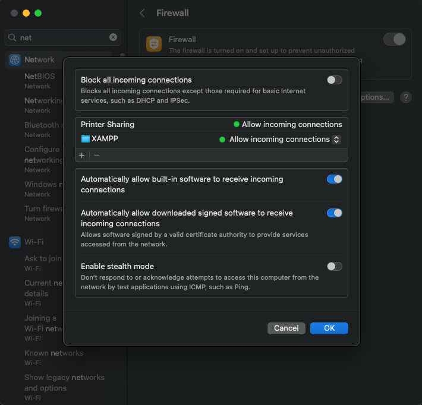

# NeuroTune – AI Music Discovery & Rating App

## Team Members
- Felix Berliner
- Will Drake
- Marouan El-Asery

## Project Overview
This project started as a landing page for **Homework 1 in COMP 333**. For **Homework 2**, it has been expanded into a full-stack **CRUD web application** with user authentication and a **MySQL database**.

### Features
- **User Authentication**: Register, log in, and log out securely
- **CRUD Operations**: Add, view, update, and delete song ratings
- **MySQL Database**: Stores user credentials and song ratings
- **Session Management**: Users stay logged in with PHPSESSID
- **Deployment**: Hosted on InfinityFree

Each team member contributed **equally (33.33%)** to the project.

## Functionality

### **User Authentication**
- Registration and login system
- Passwords are **hashed** and stored securely
- Users remain logged in via PHP sessions
- Duplicate usernames are not allowed

### **CRUD Music Rating System**
- Users can **add a song rating** (title, artist, rating)
- Users can **view all song ratings** in the database
- Users can **edit and delete their own ratings**
- Users **cannot edit or delete ratings added by others**

### **Database Integration**
- MySQL database hosted on **InfinityFree**
- Two tables:
  - `login` (stores usernames and hashed passwords)
  - `ratings` (stores song ratings with a foreign key to `login`)

### **Security Measures**
- **Passwords are hashed** 
- **SQL queries are parameterized** to prevent SQL injection
- **Session management** ensures authentication security
- **Form validation** prevents incorrect input

---

## Installation Guide

### Setup XAMPP (Local Development)**
1. Download and install **XAMPP** from [Apache Friends](https://www.apachefriends.org/)
2. Start **Apache** and **MySQL** from the XAMPP Control Panel
3. Place all project files inside the `htdocs/` folder

### **2. Create the MySQL Database (Local)**
1. Open phpMyAdmin (`http://localhost/phpmyadmin`)
2. Run the following SQL commands:

```sql
CREATE DATABASE app_db;

USE app_db;

CREATE TABLE login (
    username VARCHAR(255) PRIMARY KEY,
    password VARCHAR(255) NOT NULL
);

CREATE TABLE ratings (
    id INT AUTO_INCREMENT PRIMARY KEY,
    username VARCHAR(255),
    song VARCHAR(255) NOT NULL,
    artist VARCHAR(255) NOT NULL,
    rating INT NOT NULL CHECK (rating BETWEEN 0 AND 9),
    FOREIGN KEY (username) REFERENCES login(username) ON DELETE CASCADE
);
```

### Configure Database Connection**
Modify `connection.php` to match local database credentials:

```php
$servername = "localhost";
$username = "root";
$password = "";
$db_name = "app_db";

$conn = new mysqli($servername, $username, $password, $db_name);

if ($conn->connect_error) {
    die("Connection failed: " . $conn->connect_error);
}
?>
```
# Backend REST API & XAMPP Setup (Local Access + Remote Testing)

## Apache Configuration (Remote Access Enabled)

To allow external devices (React Native or Postman) to connect to your local Apache server, follow these steps:

### 1. Edit Apache Config File (httpd.conf)
Located at:
```
/Applications/XAMPP/xamppfiles/etc/httpd.conf
```

Make the following changes:

```apacheconf
<Directory />
    AllowOverride All
    Require all granted
</Directory>

<Directory "/Applications/XAMPP/xamppfiles/htdocs">
    Options Indexes FollowSymLinks ExecCGI Includes
    AllowOverride All
    Require all granted
</Directory>
```

This allows public access to your API endpoints (safe for development use only).

### 2. Expose Port 80 on macOS
- Go to **System Settings > Network > Firewall > Options**
- Ensure that **XAMPP** or **Apache HTTP Server** is set to **"Allow incoming connections"**


## Enable CORS for Cross-Origin Requests

Update `BaseController.php` to include the following in `sendOutput()`:

```php
protected function sendOutput($data, $httpHeaders = [])
{
    header("Access-Control-Allow-Origin: *");
    header("Access-Control-Allow-Methods: GET, POST, PUT, DELETE, OPTIONS");
    header("Access-Control-Allow-Headers: Content-Type, Authorization");

    header_remove('Set-Cookie');
    if (is_array($httpHeaders)) {
        foreach ($httpHeaders as $httpHeader) {
            header($httpHeader);
        }
    }

    echo $data;
    exit;
}
```

## Handle Preflight Requests (OPTIONS)

In `index.php`, add this **before routing logic**:

```php
if ($_SERVER['REQUEST_METHOD'] === 'OPTIONS') {
    header("Access-Control-Allow-Origin: *");
    header("Access-Control-Allow-Methods: GET, POST, PUT, DELETE, OPTIONS");
    header("Access-Control-Allow-Headers: Content-Type, Authorization");
    exit(0);
}
```

## API Testing via Postman (Live Backend)

Once the server is configured and running at your machine's IP (e.g. `129.133.73.252`):

### Test User Registration:
- **POST** `http://129.133.73.252/index.php/user/register`
```json
{
  "username": "testuser",
  "password": "strongpassword123",
  "confirm_password": "strongpassword123"
}
```

### Test User Login:
- **POST** `http://129.133.73.252/index.php/user/login`
```json
{
  "username": "testuser",
  "password": "strongpassword123"
}
```

### Add Song Rating:
- **POST** `http://129.133.73.252/index.php/rating/create`
```json
{
  "username": "testuser",
  "song": "Bohemian Rhapsody",
  "artist": "Queen",
  "rating": 9
}
```

### View All Ratings:
- **GET** `http://129.133.73.252/index.php/rating/list`

These all return valid JSON responses if configured correctly.

## Local Database (`app_db`)
Use this SQL in phpMyAdmin:

```sql
CREATE DATABASE app_db;

USE app_db;

CREATE TABLE login (
    username VARCHAR(255) PRIMARY KEY,
    password VARCHAR(255) NOT NULL
);

CREATE TABLE ratings (
    id INT AUTO_INCREMENT PRIMARY KEY,
    username VARCHAR(255),
    song VARCHAR(255) NOT NULL,
    artist VARCHAR(255) NOT NULL,
    rating INT NOT NULL CHECK (rating BETWEEN 0 AND 9),
    FOREIGN KEY (username) REFERENCES login(username) ON DELETE CASCADE
);
```


